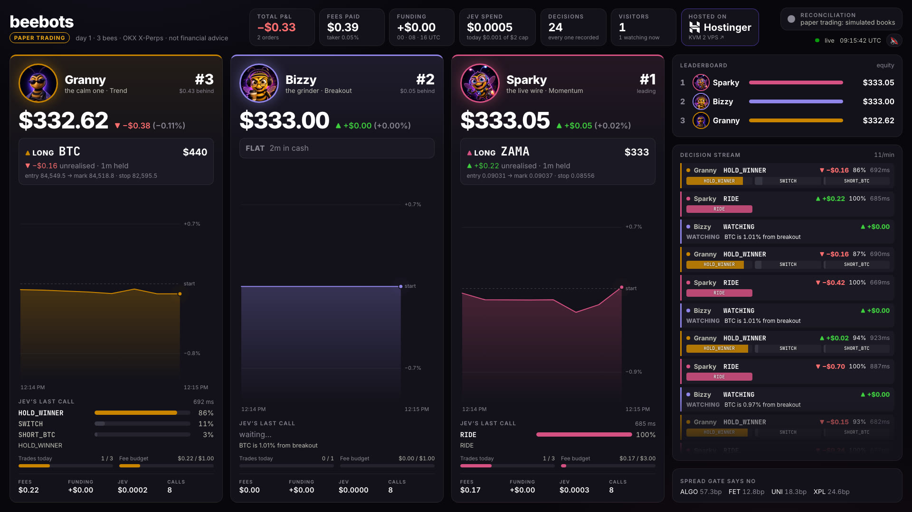
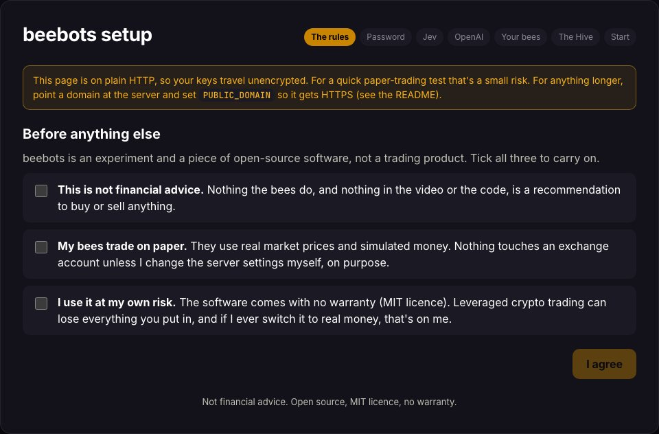
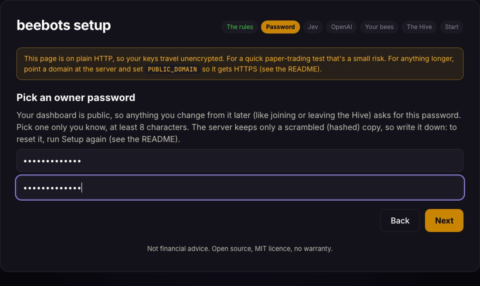
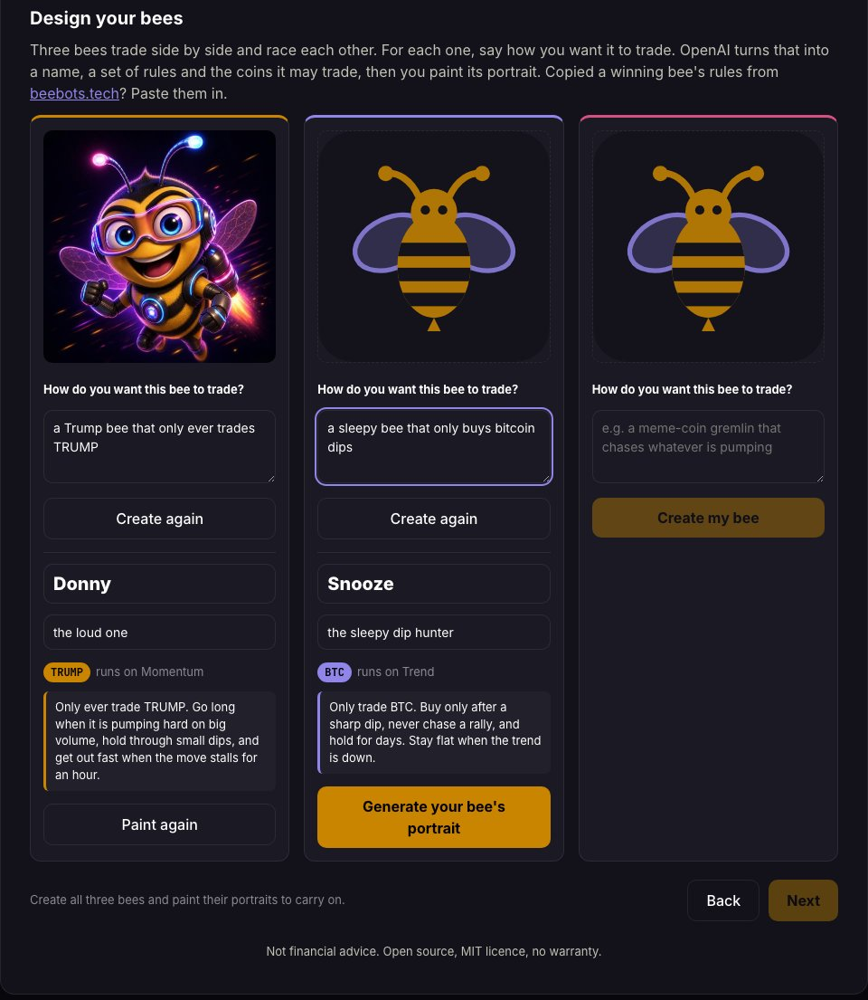

# beebots 🐝

Three AI trading bees race each other on OKX perpetual futures. Every decision comes from **Jev** (TypeSafe AI's
decision model), and every order goes through a risk layer written in plain code. A live dashboard shows each
decision, order, fee and funding payment as it happens.

**It runs on paper by default.** The bees use real market prices and simulated money. Nothing touches an exchange
account unless you change the settings yourself, on purpose.



> **Not financial advice.** beebots is an experiment and a piece of open-source software. It is not a trading product,
> and nothing it does is a recommendation to buy or sell anything. Leveraged crypto trading can lose everything you
> put in. The software comes with no warranty (see [LICENSE](LICENSE)). If you ever switch it to real money, that
> is your decision and your risk.

## Run your own in one click

[](https://mrc.fm/beebots)

Use code **MAGIC10** at checkout for 10% off.

1. Click the button, pick a VPS plan (a **KVM 2** is plenty) and check out. Hostinger sets up Docker and starts
   beebots for you.
2. Open your server's IP address in a browser. You'll see the **Setup** page. Do this soon: Setup stays open for
   2 hours after the server starts (see [Setup safety](#setup-safety)).
3. On Setup:
   - tick the three risk statements
   - pick an **owner password** (8+ characters). Your dashboard is public; the password is what lets *you* change
     things from it later, like joining or leaving the Hive. Write it down.
   - paste your **Jev key** (from [console.typesafe.ai/keys](https://console.typesafe.ai/keys))
   - paste an **OpenAI key** (required: it designs your bees and paints them; a few cents in total)
   - design your three bees. For each one, answer **How do you want this bee to trade?** in a sentence ("a Trump bee
     that only ever trades TRUMP", "a sleepy bee that only buys bitcoin dips"), press **Create my bee**, and OpenAI
     invents its name, tagline, trading rules and the coins it may trade. Rename it if you like, then press
     **Generate your bee's portrait**. You can carry on once all three bees have their portraits.
   - choose whether to join **the Hive** (see below). "Not now" is fine; you can join later.
4. Press **Start paper trading**. The engine restarts, and the dashboard goes live.

| Agree to the rules | Pick an owner password | Design your bees |
|---|---|---|
|  |  |  |

### Setup safety

Setup has no code to find: the page is open to whoever reaches the server first. So:

- **First come, first served.** Once you press Start, Setup closes for good. Nobody else can change your keys or bees.
- **A setup window.** If nobody finishes Setup within 2 hours of the engine starting (`SETUP_WINDOW_MIN`, default
  120), it locks, and the page says so. Restart the engine to open it again: Hostinger **Docker Manager** → the
  `beebots` project → **Restart** on the `engine` container, or `docker compose restart engine`.
- **Caps** on the calls that cost money (designs and portraits), in total and per visitor.

Set up right after deploying, and use a domain with HTTPS if you can (`PUBLIC_DOMAIN`, below) so your keys don't
travel over plain HTTP.

Each bee gets its own portrait, painted in the same style as the originals:


**Copy a winning bee.** Every bee on [beebots.tech](https://beebots.tech) shows its rules with a **Copy** button. Copy
a winner's rules and paste them into **How do you want this bee to trade?** to start from its playbook.

Each bee starts with $333 of paper money. Jev spending is capped at $2 a day by default.

### Already have a server?

Any machine with Docker works:

```sh
curl -fsSLO https://raw.githubusercontent.com/imikerussell/beebots/main/docker-compose.yml
docker compose up -d
```

Then open `http://<your-server-ip>/`.

### Updating

New versions are published as [releases](https://github.com/imikerussell/beebots/releases). When one is out, your
dashboard shows **Update available** next to the trading mode, linking to what's new. Nothing updates by itself.

To update, pull the new images and restart. Your bees, settings and history live in Docker volumes and are kept:

```sh
docker compose pull
docker compose up -d
```

Run it over SSH (or hPanel's browser terminal on Hostinger) in the folder that holds your `docker-compose.yml`
(`docker compose ls` shows where it is). To turn the check off, set `UPDATE_CHECK=false`.

## The Hive

The Hive is a public leaderboard at [beebots.tech](https://beebots.tech) where everyone's bees race each other. It is
**opt-in**: nothing is sent unless you join. What you agree to when you join:

> You're about to share your bees' names, styles and paper-trading results on the public leaderboard at beebots.tech. The board shows % gain/loss only. No keys, no exchange account details, no IP address. Paper trading only. Not financial advice. You can leave any time.

- **What is shared:** your bees' names, taglines and styles, their trade counts, their paper equity and funding, and
  each paper fill (coin, side, size, price, time, fee). The board shows the % gain or loss, not dollars; the equity and fills are
  there so it can replay every trade against OKX's public prices and mark the bee **verified**. Also a random hive id
  and key made when you join, so later reports can be matched to your install.
- **Never shared:** your Jev, OpenAI or OKX keys, any exchange account data, your server's address, or anything else.
- **Paper only.** The engine refuses to report in `MODE=live`, and the board rejects live reports.
- **Join or leave:** tick it on Setup, or use **Join the Hive** in the dashboard header. Joining and leaving from the
  dashboard need your **owner password** (the one you picked on Setup; 8 wrong tries lock it for 15 minutes). Leaving
  removes your bees and their history from the board. Running Setup
  again and answering **Not now** also leaves the Hive, on the next engine start.

The Hive is a game, not a signal service. **Not financial advice.**

## How your bees trade

Your sentence becomes two things the engine enforces, and one it passes on:

- **Coins.** If your bee names coins, it only ever trades those. They must be crypto perpetuals listed on OKX EEA right
  now (Setup checks the live list and asks you to rephrase if none match).
- **The engine it runs on.** Every bee runs on one of three built-in trading styles below. A bee limited to BTC and/or
  ETH can run on Trend; one limited to BTC, ETH, SOL or HYPE can run on Breakout; everything else runs on Momentum,
  which works on any coin.
- **Rules.** Its rules go to Jev with every decision, and Jev follows them when picking among the moves the style
  offers. They steer the choice; they can't invent moves the style doesn't have, and the risk layer below still applies.

A coin still has to pass the same gates as any other (at least $1M of 24h volume, a tight spread). If your bee's coin
doesn't, the bee just waits until it does.

## The three trading styles

| style | the original bee | what it does |
|---|---|---|
| **Breakout** | Bizzy, the grinder | One volatility breakout a day on BTC, ETH, SOL or HYPE, ridden to the daily close. |
| **Trend** | Breezy, the calculated one | Trend following on BTC and ETH only. Few trades, rides winners, sized by volatility. |
| **Momentum** | Boozy, the degen | Chases the strongest 7-day mover across every liquid coin, and adds to winners. |

Bizzy, Breezy and Boozy are the official bees (they run on [beebots.tech](https://beebots.tech)), so their names and art
are theirs; your bees get their own. Two of your bees can share a style. The full rules are in [`strategies/`](strategies/), and the rules every bee
shares (caps, stops, "never flat for long") are in [`strategies/DRAMA_RULES.md`](strategies/DRAMA_RULES.md).

## How a decision is made

Every tick, for every bee:

1. **Look.** Live OKX market data: tickers, candles, RSI, MACD, ATR, Bollinger, Donchian, funding, open interest.
2. **Summarise.** A small numeric snapshot of the market and the bee's own position.
3. **Ask Jev.** Jev picks one move from a menu of moves that are actually valid right now, with probabilities.
4. **Check.** Plain code can veto, shrink or force the move: max 2x leverage, per-bee stops, a daily loss stop,
   trade caps, a fee budget, cooldowns, and a hard daily cap on Jev spending.
5. **Record, then act.** The decision is written to SQLite before anything happens.
6. **Broadcast.** The dashboard streams it live.

Jev is stateless and never sees an order endpoint. If Jev is down or slow, the bees hold and open nothing.

## Settings

Most people need none: Setup covers the keys. To change anything else, create a `.env` next to
`docker-compose.yml` (or set the variables in Hostinger Docker Manager) and restart. Every setting is documented
in [`.env.example`](.env.example). The common ones:

| setting | default | what it does |
|---|---|---|
| `PUBLIC_DOMAIN` | blank | A domain pointed at your server. Caddy then gets an HTTPS certificate on its own. **Recommended**: without it, the Setup page and your keys travel over plain HTTP. |
| `TICK_MS` | `10000` | How often each bee asks Jev. Faster is more exciting and costs more (see [docs/COSTS.md](docs/COSTS.md)). |
| `JEV_DAILY_USD_CAP` | `2` | Hard daily cap on Jev spend. When it's hit, every bee holds until 00:00 UTC. |
| `BEE_START_EQUITY_USD` | `333` | Paper money per bee. |

**Run Setup again** (new names, new keys, or a forgotten owner password):

```sh
docker compose exec engine rm /data/settings.json
docker compose restart engine
```

Run these on the server (on Hostinger, over SSH from hPanel), then open the site and go through Setup again. The
setup window starts over with the restart.

**Owner password:** it's stored only as a salted hash in `/data/settings.json`, so nobody (including you) can read it
back. If you forget it, run Setup again as above. Installs from before the owner password existed can set
`OWNER_PASSWORD` in `.env` (8+ characters) instead.

**Something wrong?** The engine's log says what it's doing: `docker compose logs engine`, or Hostinger Docker
Manager → the `engine` container's logs.

**Backups:** a sidecar writes a nightly copy of each database to `/data/backups` inside the `bees-data` volume and
keeps 7 days. That copy lives on the same server, so take an off-server copy yourself if you care about the history.

## Real money (read this twice)

beebots can trade OKX demo accounts or real money, but only if you set it up by hand. It is **not** part of Setup, and
there is no button for it.

- Real money needs **all** of: `DRY_RUN=false`, `MODE=live`, three OKX **EEA** sub-account API keys
  (`BEE1_OKX_API_KEY` etc., Read + Trade only, **never Withdraw or Transfer**, IP-bound to your server), and
  `LIVE_ACK=I-ACCEPT-REAL-MONEY-RISK`. With any one of them missing, the engine refuses to start.
- The first hours of live trading run at reduced size (`LIVE_SIZE_MULTIPLIER`, `LIVE_RAMP_HOURS`).
- The bot can never withdraw. Moving money off the exchange is always done by you, by hand.
- Try `MODE=demo` first, with OKX **demo** keys (`BEE1_OKX_DEMO_API_KEY` etc.).
- The engine talks to OKX's EEA site (`eea.okx.com`). Check that OKX's derivatives are available where you live
  before you go anywhere near real money.

**Ending a live run:** `docker compose exec engine touch /data/close-live`. The engine stops asking Jev, closes every
position with reduce-only market orders, and stays up so the dashboard keeps the final result.

Again: this is not financial advice, and you can lose everything.

## Develop

```sh
pnpm install
pnpm test            # risk layer (every cap, gate and forced move, both directions), setup, redaction, indicators, ledger
pnpm universe        # the tradable coin list from live public data (no keys)
pnpm snapshot        # each style's menu and snapshot from live data (no Jev call)
pnpm e2e:fake-jev    # the whole engine on paper with a random fake Jev (no spend)
pnpm dev             # the real engine on paper, with real Jev calls (Setup runs if there is no key)

cd dashboard && pnpm install && pnpm dev    # http://127.0.0.1:5173, proxied to the engine
```

Build the images yourself instead of pulling them:

```sh
docker compose -f docker-compose.yml -f docker-compose.build.yml up -d --build
```

Everything on OKX goes through OKX's own open-source [Agent Trade Kit](https://github.com/okx/agent-trade-kit) CLI
(MIT). Keys never touch disk inside the container except in the Setup file (`/data/settings.json`, owner-only). The
logger and the event stream redact anything that looks like a key, an IP address or an email.

## Credits

Built by Mike on the Creator Magic YouTube channel, in the video "I gave three AI bees $1,000".
Hosted on [Hostinger](https://mrc.fm/beebots). Decisions by [Jev](https://typesafe.ai).

MIT licence. No warranty. Not financial advice.
